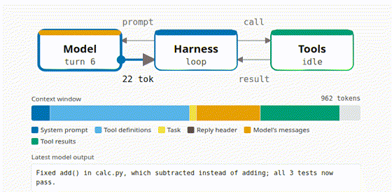
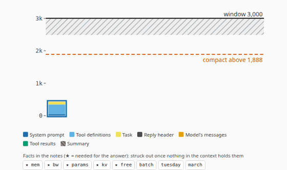
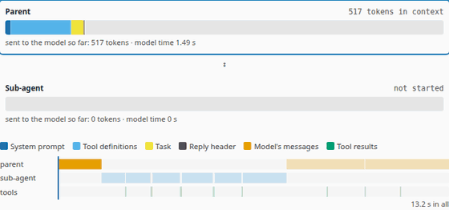
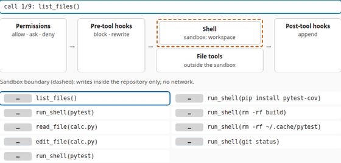
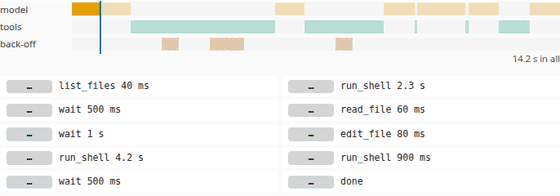
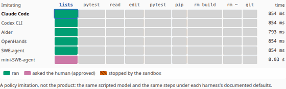
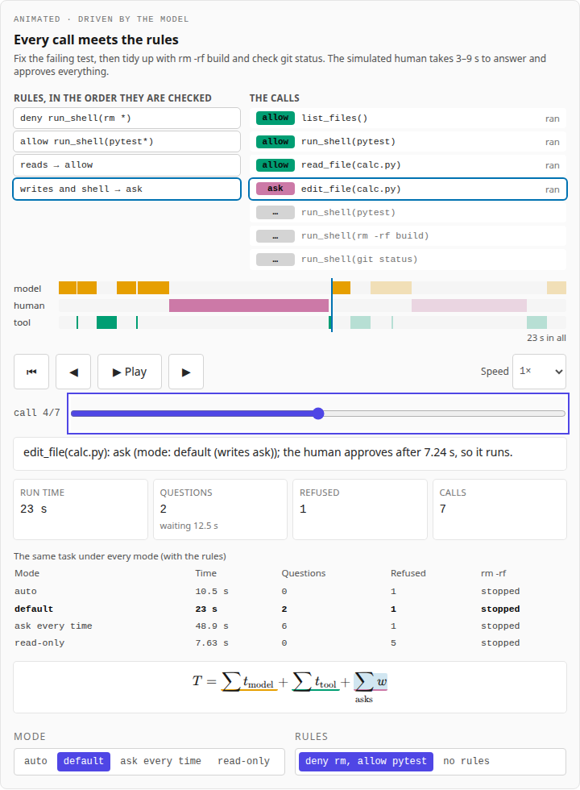
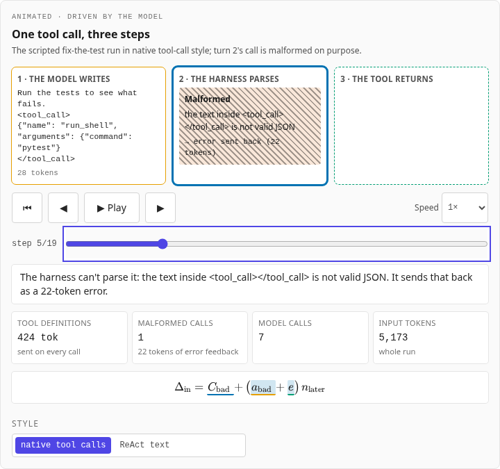
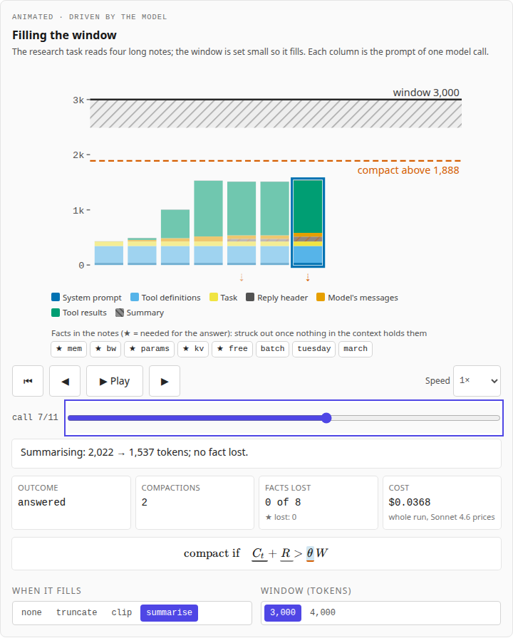
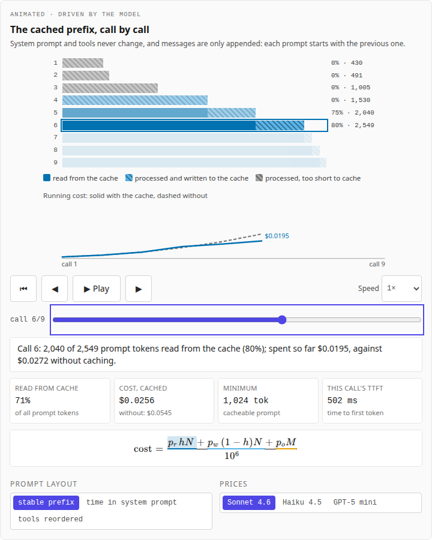

# Agent Harnesses Explained

**Live:** https://agent-harnesses-explained.vercel.app

What sits between a model and the world: the **harness**, the loop, tools, permissions and context
management that turn a chat model into an agent. Each chapter takes one of the harness's choices apart,
built around an animation, with the maths beside the picture. Every frame is computed by
[Agent_Loop_Sim](https://github.com/BrendanJamesLynskey/Agent_Loop_Sim), a deterministic agent-loop
simulator with a real tokenizer, tested against its Python reference. **No live model** is called anywhere:
the teaching runs are scripted, and three runs of a small open-weights model were recorded once and are
replayed token for token.



Part of a family of companion sites. LLM systems: the
[Transformer Decoder Explainer](https://transformer-decoder-explained.vercel.app),
[LLM Inference Explained](https://llm-inference-explained.vercel.app),
[LLM Architectures Explained](https://llm-architectures-explained.vercel.app),
[GPU Kernels Explained](https://gpu-kernels-explained.vercel.app),
[Numerics Explained](https://numerics-explained.vercel.app),
[Systolic Arrays Explained](https://systolic-arrays-explained.vercel.app) and
[Inference Trade-offs Explained](https://inference-tradeoffs-explained.vercel.app). Agents: this is the first, then
[Agent Protocols Explained](https://agent-protocols-explained.vercel.app) and
[Agent Context Explained](https://agent-context-explained.vercel.app).

## Chapters

| #   | Chapter                                                                                                    | The animation                                                                                                                        |
| --- | ---------------------------------------------------------------------------------------------------------- | ------------------------------------------------------------------------------------------------------------------------------------ |
| 01  | [The agent loop](https://agent-harnesses-explained.vercel.app/learn/01-the-agent-loop)                     | model → tool call → result → model, the context window filling token by token; a scripted run or a recorded trace                    |
| 02  | [Tool calling](https://agent-harnesses-explained.vercel.app/learn/02-tool-calling)                         | what the model writes, what the harness parses, what the tool returns; native calls vs ReAct text; a malformed call and its recovery |
| 03  | [The context window as a budget](https://agent-harnesses-explained.vercel.app/learn/03-the-context-budget) | the window filling call by call until compaction fires; truncate, clip or summarise, and the facts each loses                        |
| 04  | [Prompt caching](https://agent-harnesses-explained.vercel.app/learn/04-prompt-caching)                     | the cached prefix call by call, and the running cost with and without it; what breaks the cache                                      |
| 05  | [Permissions and the human in the loop](https://agent-harnesses-explained.vercel.app/learn/05-permissions) | allow / ask / deny rules evaluated live; the human's waits on a timeline; four modes compared                                        |
| 06  | [Sub-agents](https://agent-harnesses-explained.vercel.app/learn/06-sub-agents)                             | the parent's and the sub-agent's contexts side by side; the report handed back; tokens saved against time and money spent            |
| 07  | [Hooks and sandboxing](https://agent-harnesses-explained.vercel.app/learn/07-hooks-and-sandboxing)         | each call through permissions, pre-tool hooks, the sandbox boundary around the shell and post-tool hooks                             |
| 08  | [Failure and recovery](https://agent-harnesses-explained.vercel.app/learn/08-failure-and-recovery)         | retries with back-off and loop detection on a timeline; success against the retry budget over 100 seeded runs                        |
| 09  | [Harnesses compared](https://agent-harnesses-explained.vercel.app/learn/09-harnesses-compared)             | a sourced matrix of six public harnesses' choices, and the same task under a policy imitation of each (not the products)             |
| 10  | [Cost and latency of a task](https://agent-harnesses-explained.vercel.app/learn/10-cost-and-latency)       | a live calculator: every model call's cost and time taken apart, for any task, price, speed, cache and permission mode               |

[`/traces`](https://agent-harnesses-explained.vercel.app/traces) holds the recorded traces with their provenance.

### The hero animations

Recorded frame by frame from the engine's states (`pnpm animations`, against a local build); each is also in
`docs/media/` as WebM.

|                                                                                                             |                                                                                                                 |
| ----------------------------------------------------------------------------------------------------------- | --------------------------------------------------------------------------------------------------------------- |
|  |  |
|                |             |
|                                            |                  |

|                                                           |                                                               |
| --------------------------------------------------------- | ------------------------------------------------------------- |
|      |  |
|  |            |

## The engine

`src/lib/engine/vendor/` is Agent_Loop_Sim's TypeScript port, vendored byte for byte at the commit in
[`VENDORED.json`](src/lib/engine/vendor/VENDORED.json) (with each file's SHA-256), together with its tokenizer
data (`public/tokenizer/`), its recorded traces (`src/data/traces/`) and its fixtures. The browser runs it in
a Web Worker. `src/data/chapter_configs.json` lists every run a chapter animates (a scenario and a policy, or
a recorded trace); `scripts/make_fixtures.py` runs the same list through the **Python reference**, installed
from git at the vendored commit (`reference/requirements.txt`), and the unit tests require the TS engine to
reproduce every event and every animation frame exactly.

- **Tokens** are counted by Qwen2.5's tokenizer, which gave the same ids as llama.cpp's on every prompt the
  scenarios send.
- **Recorded traces**: Qwen2.5-1.5B-Instruct, Q4_K_M, llama.cpp on a desktop CPU, greedy decoding. It fails
  all three tasks, in instructive ways; the [traces page](https://agent-harnesses-explained.vercel.app/traces)
  says how.
- **Every number in the prose** is computed by the engine at build time (`<V of="…">`, `src/lib/agent/values.ts`);
  every code block is cut from the vendored engine.

## What is illustrative

- Prices are list prices copied on 2026-10-07 from the
  [Claude API](https://platform.claude.com/docs/en/about-claude/pricing) and
  [OpenAI API](https://developers.openai.com/api/docs/pricing) pricing pages; they change, and the token counts
  are Qwen2.5's, so a cost means "this many tokens at that price", not a quote.
- The prompt cache is a simple prefix model of the providers' documented rules.
- Hosted-model latency, tool latencies and the simulated human's answer times are illustrative; the local
  model's speed is measured (the recorded traces' llama.cpp timings).
- The scripted policies and the scripted summariser stand in for a model; chapter 3's tiny windows are chosen
  so a short task fills them.
- Descriptions of public harnesses (Claude Code, Codex CLI, Aider, OpenHands, SWE-agent, mini-SWE-agent) come
  from their documentation, with access dates; anything not read from a document is marked as inferred.
  Chapter 9's runs are **a policy imitation, not the product**: the same scripted model under the engine's
  settings closest to each harness's documented defaults.
- Chapter 7's sandbox checks command lines (a simulated shell has nothing else); a real sandbox is enforced
  by the operating system. Chapter 8's tool failure rate (30% of attempts, independent, seeded) is invented.

## Checks

| Check                                                                                                                                                                                                  | Where                                                                        |
| ------------------------------------------------------------------------------------------------------------------------------------------------------------------------------------------------------ | ---------------------------------------------------------------------------- |
| Python reference regenerates the site's fixtures; vendored hashes; traces replay                                                                                                                       | CI "Model and fixtures" (`scripts/make_fixtures.py --check`, `tests/python`) |
| TS engine = Python reference on every run, frame and seeded sweep; captions; chapters' code, equations, links, values; every matrix cell sourced or marked inferred                                    | CI "Unit Tests" (`tests/unit`)                                               |
| Every page at 1,280 and 390 px, light and dark: no errors, no overflow; every animation plays, steps, scrubs, resets, keys; reduced motion; frame captions on the page; axe; the two-group site switch | CI "E2E Tests" (`tests/e2e`)                                                 |
| Lighthouse ≥ 0.9 (performance, accessibility, best practices)                                                                                                                                          | CI "Lighthouse"                                                              |

## Develop

```bash
pnpm install
pnpm dev                                    # http://localhost:3000
pnpm test && pnpm lint && pnpm typecheck
python3 -m venv .venv && .venv/bin/pip install -r reference/requirements.txt
.venv/bin/python scripts/make_fixtures.py --check
pnpm test:e2e                               # builds, then serves under --no-experimental-require-module
```

Deploying, smoke checks and updating the engine: [RUNBOOK.md](RUNBOOK.md).

## Origin

The site's structure, animation infrastructure (`useStepper`, `AnimationPanel`, the clock), MDX pipeline,
CI and checks are copied from [gpu-kernels-explained](https://github.com/BrendanJamesLynskey/gpu-kernels-explained);
the engine vendoring follows [llm-inference-explained](https://github.com/BrendanJamesLynskey/llm-inference-explained).

## Licence

MIT. The vendored Qwen2.5 tokenizer merges are Apache-2.0 (see Agent_Loop_Sim's `NOTICE`).
